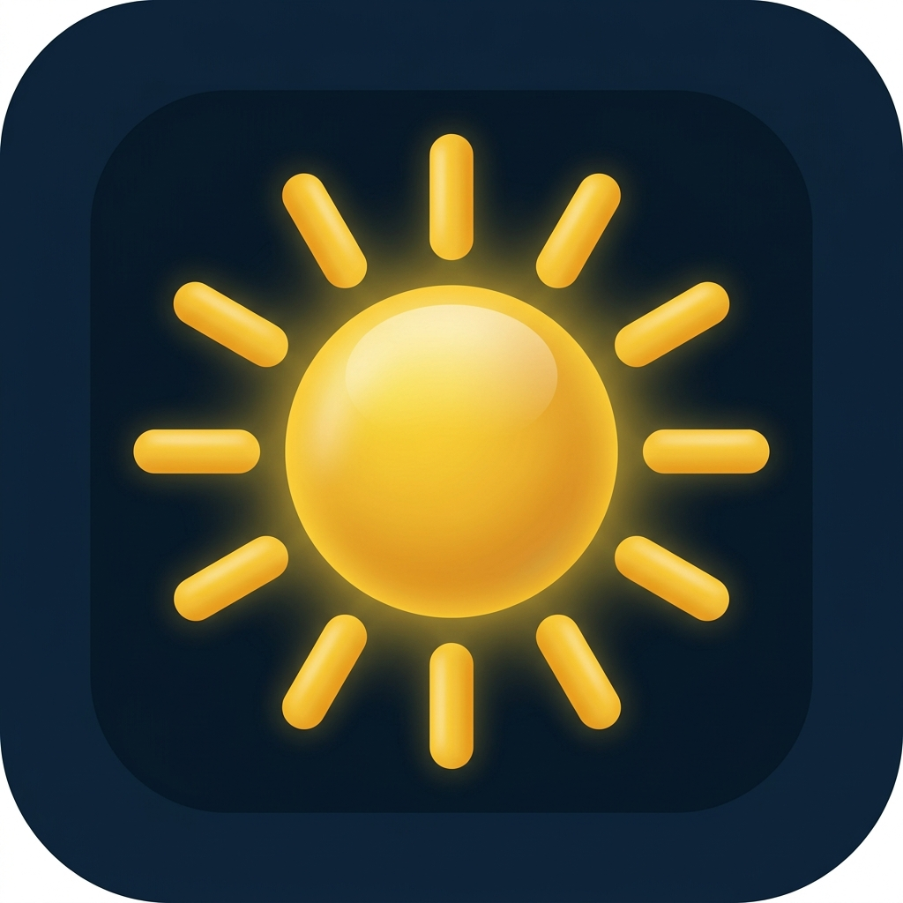

# PV Monitor

  

A Flutter application for monitoring photovoltaic systems in real time. The app displays electrical and environmental measurements, historical data, and analytics to help users track the performance of their solar installation.

## Features

- 📊 Real-time monitoring of photovoltaic data
- ⚡ Voltage, current, power, and energy measurements
- 🌡️ Environmental monitoring (temperature, humidity, irradiance)
- 📈 Historical charts and statistics
- ☁️ Firebase cloud synchronization
- 🤖 AI-based energy production prediction

## Screenshots

| Dashboard | Statistics |
|-----------|------------|
|  |  |

## Getting Started

This project is a starting point for a Flutter application.

Useful resources:

- [Learn Flutter](https://docs.flutter.dev/get-started/learn-flutter)
- [Write your first Flutter app](https://docs.flutter.dev/get-started/codelab)
- [Flutter Documentation](https://docs.flutter.dev/)
